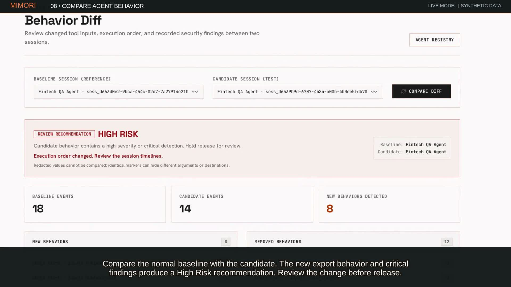
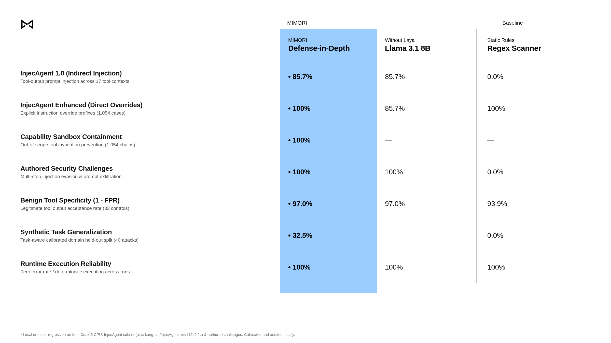

<p align="center"></p>

# MIMORI

[](https://github.com/j33v4nz/MIMORI/actions/workflows/ci.yml) [](https://github.com/j33v4nz/MIMORI/actions/workflows/native-integrations.yml)

**Inspect AI-agent behavior before you ship.**

MIMORI is an open-source, self-hosted security and behavior review platform for AI agents across frameworks and custom runtimes. Record tool activity, review findings, and compare execution sessions before releasing a change. Its common telemetry API works independently of the framework running your agent.

**Early release / public beta.** Findings are review signals. Coverage depends on instrumentation and configuration; a clear comparison does not certify safety.

[Quickstart](#quickstart) · [Integrations](docs/integrations.md) · [Documentation](docs/README.md) · [Python SDK](sdk/README.md) · [Contributing](CONTRIBUTING.md) · [Security](SECURITY.md)

## Frameworks and runtimes

MIMORI ships 16 Python framework/provider adapters, a Vercel AI SDK JavaScript adapter, and direct Python/HTTP instrumentation:

| Integration path | Frameworks / runtimes |
| --- | --- |
| Graph and orchestration | LangChain, LangGraph, CrewAI, AutoGen/AG2, MetaGPT, Agno |
| Retrieval and pipelines | LlamaIndex, Haystack, DSPy |
| Typed and tool-using agents | OpenAI Agents SDK, Pydantic AI, Smolagents, Google ADK, Semantic Kernel, Composio |
| Provider SDK | Anthropic |
| JavaScript | Vercel AI SDK source adapter; custom Node.js through HTTP |
| Your own stack | Python client/manual logging; authenticated HTTP from other languages |

See the [integration matrix](docs/integrations.md) for install extras, adapter sources, coverage, and verification scope. Install only the dependencies needed by your agent. Shipped adapters do not establish compatibility with every upstream version.

## Demo

[](docs/demo-video/MIMORI-fast-silent-demo.mp4)

**[Watch the 72-second silent walkthrough](docs/demo-video/MIMORI-fast-silent-demo.mp4).** This example uses a real local Llama 3.1 agent through LangChain with synthetic fintech tools. The same ingestion, findings, dashboard, and comparison services accept telemetry from the other integration paths above. No money is moved and no SQL is executed. [Demo details](docs/demo-video/README.md).

## Security benchmark: defense-in-depth

Prompt injection cannot be solved with a single regex or a single classifier. MIMORI enforces **layered defense-in-depth** across three complementary boundaries:

1. **Zero-Latency Pattern Scanner:** Catches explicit instruction-override prefixes in `<0.05ms`.
2. **Task-Aware Semantic Review:** Intercepts indirect prompt injections inside third-party tool responses (web pages, PDFs, API data) relative to user intent before agent ingestion (85.7% recall, 98.4% precision).
3. **Deterministic Capability Sandboxing:** Mathematical least-privilege boundary at tool execution. Even if an injection slips past all text classifiers, unauthorized tool calls are physically blocked.

<p align="center">
  
</p>

| Benchmark & Capability Suite | MIMORI (Full Stack) | Llama 3.1 (Semantic Alone) | Regex Scanner |
| :--- | :---: | :---: | :---: |
| **InjecAgent 1.0 (Indirect Injection)** | **• 85.7%** | 85.7% | 0.0% |
| **InjecAgent Enhanced (Direct Overrides)** | **• 100%** | 85.7% | 100% |
| **Tool Capability Sandbox Containment** | **• 100%** (1,054/1,054) | — | — |
| **Authored Adversarial Challenges** | **• 100%** | 100% | 0.0% |
| **Benign Tool Specificity (1 - FPR)** | **• 97.0%** | 97.0% | 93.9% |
| **Runtime Execution Reliability** | **• 100%** (0 errors) | 100% | 100% |

*Tested on frozen InjecAgent regression (`uiuc-kang-lab/InjecAgent`, rev `f19c9f2c`) with local CPU inference. See the [Tool Response Security Guide](docs/tool-response-security.md).*

## What you can do

- Record model, chain, and tool events exposed by your integration.
- Inspect agents, session traces, recorded events, and organization-scoped security findings.
- Redact recognized sensitive values in Python SDK telemetry before transport.
- Compare recorded signatures, inputs, relevant ordering, and findings between sessions.
- Configure detection rules and optional classifier/judge routing.
- Apply opt-in SDK guardrails to operations your application explicitly wraps.


## Quickstart

You need Node.js 22 (recommended), npm, and Docker for local Supabase. Python 3.10+ is needed for the SDK. A managed Supabase setup is also available in the [local development guide](docs/local-development.md).

### 1. Install and start

```bash
git clone https://github.com/j33v4nz/MIMORI.git
cd MIMORI
npm ci
npm run setup
npm run dev
```

Setup starts local Supabase, applies pending migrations and local seeds, and configures `.env.local` while preserving existing data. Do not commit that file. Open **http://localhost:3000**, sign up, and sign in. If email confirmation is enabled, local messages appear at **http://127.0.0.1:54324**.

### 2. Create a key and send demo telemetry

Open **API Keys**, enter a label, and choose **Generate API Key**. Keep the generated key outside source code.

In a second Bash terminal:

```bash
read -rsp 'MIMORI API key: ' MIMORI_DEV_API_KEY; echo
export MIMORI_DEV_API_KEY
npm run demo
```

This sends synthetic telemetry and prints a behavior-comparison link. It does not run a real model. Use **Agents**, **Events**, and **Detections** to inspect what was stored.

### 3. Connect your agent

From the repository root, install the source SDK in your Python environment:

```bash
pip install -e ./sdk
```

Use `MIMORIClient` around your custom loop, or install the extra and attach the handler for your framework—for example `pip install -e './sdk[crewai]'`. JavaScript applications can use the Vercel source adapter or HTTP. The [integration guide](docs/integrations.md) routes you to the appropriate hook and example.

Start with a runnable example:

- [Custom Python tool loop](sdk/examples/README.md#custom-python-no-framework): base SDK only, no framework or model provider.
- [Custom Node.js tool loop](sdk/examples/README.md#custom-nodejs-direct-http): built-in HTTP client, no Python SDK or agent framework.
- [Scripted LangChain fintech agent](sdk/examples/README.md): reproducible, no model-provider key required.
- [Live Ollama/Llama 3.1 agent](docs/demo-video/README.md#run-the-live-model-example): local model inference with synthetic tools.

Use source installation for the features documented here; verify published package versions separately.

## Architecture

```text
Agent → adapter / Python client / sanitized HTTP → authenticated ingestion → organization-scoped Postgres
                                            ↓
                                   rules / optional classifier
                                            ↓
                                   findings / queued judge work
                                            ↓
                              dashboard / session behavior comparison
```

Detection recovery, judge, and retention workers require operator scheduling. Webhook delivery is best effort. Review [architecture](docs/architecture.md), [recovery and durability](docs/durability.md), [security boundaries](docs/security-architecture.md), and [behavior-comparison limits](docs/behavior-diff.md) before deployment.

## Repository layout

| Folder | Purpose |
| --- | --- |
| `app/` | Next.js dashboard, API, and colocated unit tests |
| `sdk/` | Python SDK, framework adapters, examples, and tests |
| `examples/multiagent/` | Example multi-agent workflow |
| `supabase/` | Database migrations and local seeds |
| `scripts/` | Setup, demo, experimental classifier, and release utilities |
| `tests/e2e/` | Browser tests |
| `docs/` | User/contributor documentation and demo assets |
| `notebooks/` | Experimental training workflow; weights are separate release assets |
| `public/` | Dashboard static assets |

Root configuration files are required by the app and tooling. Maintainer marketing plans and workstation artifacts are not part of the public tree.

## Verification

```bash
npm run lint
npm run typecheck
npm test
npm run build
pip install -e './sdk[dev]'
python -m pytest sdk/tests
```

For database isolation, authenticated onboarding, secret scans, distribution checks, and deployment gates, use the [release checklist](docs/release-checklist.md). Local checks, CI, live providers, and production durability are separate verification scopes.

## Contributing and support


Licensed under [MIT](LICENSE).
